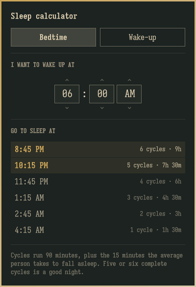

# Sleep Calculator

A bar widget for [Omarchy](https://omarchy.org) answering the two questions
[sleepcalculator.com](https://sleepcalculator.com) answers, in the place you
already look for the time.

**Bedtime** — what time to fall asleep to be up at a set time.
**Wake-up** — what time to get up if you go to bed right now.

Both lists run longest night first, from six 90-minute cycles down to one. The
top two rows — six and five cycles — are the ones the site marks as a good
night, and they are the only rows drawn at full strength here.

## The math

One cycle is 90 minutes, and the average person is allowed 15 minutes to fall
asleep. So a row is:

    bedtime  = wake time − (cycles × 90 + 15) minutes
    wake time = now       + (cycles × 90 + 15) minutes

for cycles 6, 5, 4, 3, 2, 1. That is exactly what the site's own
`scripts/common.js` does; it writes the same thing as an hours offset,
`(6 - i) * -1.5 - .25`.

Wake at 7:00 AM and both agree on 9:45 PM, 11:15 PM, 12:45 AM, 2:15 AM,
3:45 AM, 5:15 AM.

### Where this deliberately differs

The site's `formatTime()` works in a 12-hour space of 720 minutes and flips
AM/PM at most once. That breaks at 12 o'clock, twice over:

- it reads a picked "12:30" as 750 minutes rather than 30, so **every row for a
  12 o'clock wake time comes out twelve hours wrong** — ask it for a bedtime to
  wake at midnight and it says 2:45 AM where the answer is 2:45 PM;
- its `> 720` test misses the flip when a wake-up lands **exactly** on 12:00,
  so going to bed at 2:45 AM gives "12:00 AM" instead of noon.

`SleepMath.js` uses minutes-of-day arithmetic mod 1440, which has neither
problem. Compared row for row across every minute of the clock — 17,280 rows —
it agrees with the site on all 16,548 it gets right and differs only on the 732
it does not.

## Using it

| Where | Action | What it does |
|---|---|---|
| Bar icon | left click | open / close the panel |
| Bar icon | right click | flip between bedtime and wake-up |
| Bar icon | hover | the top recommendation, without opening anything |
| Time cell | left click / scroll up | later |
| Time cell | right click / scroll down | earlier |
| Chevrons | click | same, one step |
| Panel | `←` `→` | pick hour / minute / AM-PM |
| Panel | `↑` `↓` | step the selected cell |
| Panel | `b` / `w` | bedtime / wake-up mode |
| Panel | `Enter` / `Space` | flip mode |
| Panel | `Esc` | close |

The hour steps by an hour and the minute by five, but all three cells step one
underlying time, so minutes carry into hours and hours carry into AM/PM the way
a clock does.

The wake time and the mode are written back to `shell.json`, so the panel opens
holding the time you set last night. Wake-up mode re-reads the clock every
minute while it is open.

## Settings

In the widget's entry in `~/.config/omarchy/shell.json`, or via
`omarchy bar set dielerorn.sleep-calculator <key> <value>`:

| Key | Default | Meaning |
|---|---|---|
| `wakeTime` | `"07:00"` | The time bedtimes count back from, 24-hour `HH:MM` |
| `mode` | `"bedtime"` | Which question the panel opens on: `bedtime` or `wakeup` |
| `panelWidth` | `300` | Panel width in the shell's spacing units |

## Binding it to a key

The panel answers on the shell's IPC, so it can be summoned without the mouse:

    omarchy-shell dielerorn.sleep-calculator toggle

In `~/.config/hypr/bindings.lua`:

    o.bind("SUPER CTRL", "S", "Sleep calculator", "omarchy-shell dielerorn.sleep-calculator toggle")

## Install

    omarchy plugin add https://github.com/Dielerorn/omarchy-sleep-calculator.git --enable

Then put it wherever you want it in the bar:

    omarchy bar move dielerorn.sleep-calculator --section right

## Files

    manifest.json   plugin declaration and settings schema
    LICENSE         MIT
    Panel.qml       bar button, popup, and the time picker
    SleepMath.js    the arithmetic, kept separate so it can be diffed
                    against the site's scripts/common.js
